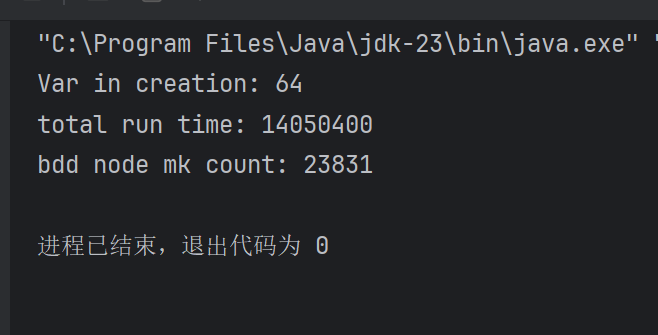
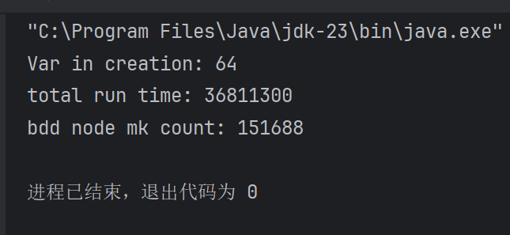
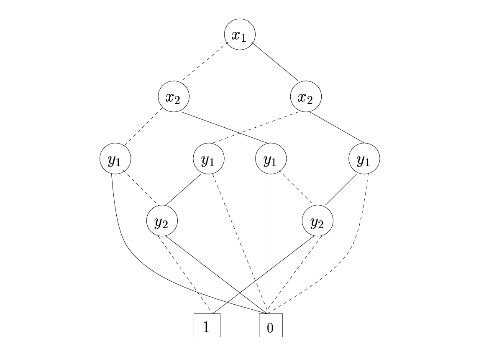
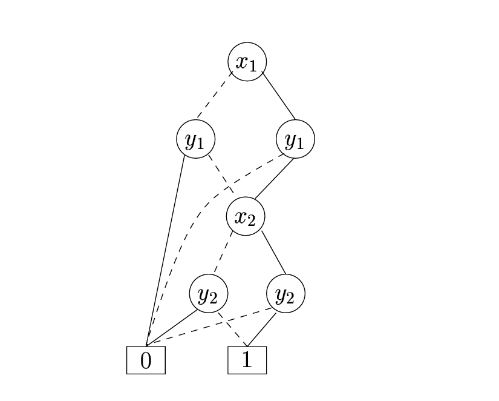

不同创建顺序造成运行时间和创建节点数不同的原因

从图片可以看到，创建节点时都是64个节点，分别对应32个bdd和32个notbdd。

从代码105行可以看出创建顺序改变会造成组装时会有不同的顺序，即一个是ip第32位在第一层，位数递减向下；一个是ip第一位在第一层，位数递增向上。
BDD的结构不一样，在进行apply操作时会有先后顺序，即从第32位开始组装或者从第1位开始组装。
由ROBDD的性质可知，重复的节点不会被创建，在apply操作时有的节点不会影响结果，就不会创建。通过画图可以知道，有的节点取值以后可以直接到达终端或者跳过中间一部分节点，这样可以节约大量内存开销。

举个例子，两张图是同一个表达式，但是创造节点的顺序不同。在第二张图中，第二层的y~1~取值以后可以直接到达终端或者到达x~2~,且x~2~还会因为重复只需要创建一个。由此省下了很多空间和时间开销。

参考论文：An Introduction to BDD